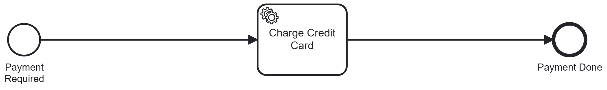

# Camunda 8 - Develop Your First Job Worker (Java) - Lab

Lab project for the [Camunda 8 - Develop your first job worker (Java)](https://academy.camunda.com/c8-develop-first-worker-java/) course on Camunda Academy.

This project introduces the end-to-end basics of building a Camunda 8 Java worker:

- connecting a Java application to Camunda 8 SaaS
- deploying and executing a BPMN process with a service task
- implementing a job worker to complete work and return output variables

Difficulty: Foundation | Time: ~2h | Platform: Camunda 8.9+

## What you will learn

- Create and run a Java application that connects to Camunda 8
- Start a process instance from code
- Implement a job worker (`chargeCreditCard`) using the Camunda Java client
- Read process variables in the worker and complete the job with output variables
- Understand the relationship between BPMN task type and worker job type

## Overview

The process definition `paymentProcess` contains one service task:



- **Charge Credit Card** (`chargeCreditCard`) handled by `CreditCardServiceHandler`

High-level flow:

1. The app creates a process instance with payment variables.
2. A worker polls for `chargeCreditCard` jobs.
3. The handler calls `CreditCardService` and returns a `confirmation` output variable.

## Prerequisites

### Knowledge

- Awareness of Camunda
- Competent with BPMN
- Competent with Java

Recommended preparatory material:

- [Camunda - Overview](https://academy.camunda.com/c8-overview)

### Tools & Access

- Java 21+
- Maven 3.x
- IDE (Eclipse, IntelliJ, or VS Code)
- Camunda 8 SaaS account with:
  - a running cluster
  - OAuth client credentials

## Configuration

This lab uses constants in `src/main/java/com/camunda/academy/PaymentApplication.java` for Camunda connection settings.

Update the following placeholders before running:

- `CAMUNDA_REST_ADDRESS` (for example: `https://[REGION].zeebe.camunda.io/[CLUSTER-ID]`)
- `CAMUNDA_GRPC_ADDRESS` (for example: `https://[CLUSTER-ID].[REGION].zeebe.camunda.io:443`)
- `CAMUNDA_CLIENT_ID`
- `CAMUNDA_CLIENT_SECRET`

Defaults already provided in code:

- `CAMUNDA_AUTHORIZATION_SERVER_URL = https://login.cloud.camunda.io/oauth/token`
- `CAMUNDA_TOKEN_AUDIENCE = zeebe.camunda.io`

## Build

```bash
mvn clean package
```

## Run

Before running, deploy `src/main/resources/paymentProcess.bpmn` to your Camunda 8 cluster (Desktop Modeler or Web Modeler).

Then start the application:

```bash
mvn exec:java -Dexec.mainClass="com.camunda.academy.PaymentApplication"
```

When running successfully, the app:

1. creates one `paymentProcess` instance
2. starts a worker for job type `chargeCreditCard`
3. processes the payment task and completes the job with a `confirmation` variable

## Project Structure

```text
src/main/java/com/camunda/academy/
├── PaymentApplication.java                  # Entry point: client setup, instance creation, worker startup
├── handler/
│   └── CreditCardServiceHandler.java        # Job handler for chargeCreditCard
└── service/
    └── CreditCardService.java               # Simulated payment logic

src/main/resources/
├── paymentProcess.png                       # Process diagram used in this README
└── paymentProcess.bpmn                      # BPMN process definition
```

## Dependencies

- `io.camunda:camunda-client-java` (8.9.1) - Camunda 8 Java client
- `org.slf4j:slf4j-simple` (2.0.16) - logging
- `junit:junit` (4.13.2) - test dependency

## License

This project is licensed under the Apache-2.0 License. See [LICENSE](LICENSE).
